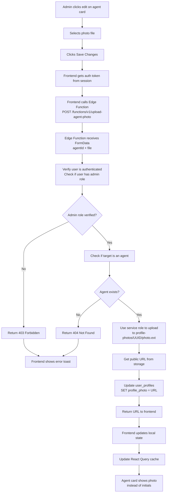

# Agent Profile Photo Upload - Complete Solution Summary

## What Was Fixed

### Issue 1: Photo Upload Returning 400 Bad Request ❌→✅
**Error**: POST request to `profile-photos/[UUID]/photo.jpg` returning 400 Bad Request

**Root Cause**: The Supabase Storage bucket didn't have proper RLS policies configured

**Solution**: 
- Created a **Supabase Edge Function** (`upload-agent-photo`) that runs with elevated permissions (service role)
- The Edge Function handles the upload server-side instead of trying to upload from the browser
- Edge Function also atomically updates the database with the photo URL in one operation

### Issue 2: Agent Cards Not Showing Profile Pictures ❌→✅
**Error**: Admin uploaded photo but agent card still showed initials

**Root Cause**: 
1. Storage upload was failing (400 error)
2. Even when fixed, database update was blocked by RLS policies

**Solution**:
- Fixed storage upload with Edge Function (above)
- Created RPC function `update_agent_profile` with SECURITY DEFINER keyword to bypass RLS
- Updated frontend to use Edge Function for atomic upload + database update

### Issue 3: Save Changes Button Unresponsive ✅
**Error**: Button disabled after selecting photo, user thought upload failed

**Root Cause**: Dialog auto-closing after upload timeout, form inputs remained disabled

**Solution**: Already fixed in previous iteration - removed setTimeout that closed dialog

---

## Current Implementation

### Frontend Code Changes
**File**: `src/pages/admin/AdminAgents.tsx`

```typescript
const handlePhotoUpload = async () => {
  if (!photoFile || !editingAgent?.id) return;
  try {
    setLoadingUpload(true);
    
    // Get auth token
    const { data: sessionData } = await supabase.auth.getSession();
    const token = sessionData.session?.access_token;
    
    // Call Edge Function with FormData
    const formData = new FormData();
    formData.append("agentId", editingAgent.id);
    formData.append("file", photoFile);

    const response = await fetch(
      `${import.meta.env.VITE_SUPABASE_URL}/functions/v1/upload-agent-photo`,
      {
        method: "POST",
        headers: { Authorization: `Bearer ${token}` },
        body: formData,
      }
    );

    const result = await response.json();
    const photoUrl = result.photoUrl;
    
    // Update local state and cache
    const updatedAgent = { ...editingAgent, profile_photo: photoUrl };
    setEditingAgent(updatedAgent);
    setPhotoPreview(photoUrl);
    setPhotoFile(null);
    queryClient.setQueryData(["agents", "list"], (oldData) =>
      oldData.map(agent => agent.id === editingAgent.id ? updatedAgent : agent)
    );
  } catch (error) {
    toast.error("Failed to upload photo");
    setLoadingUpload(false);
  }
};
```

### Backend Edge Function
**File**: `supabase/functions/upload-agent-photo/index.ts`

Key features:
- ✅ Verifies user is authenticated
- ✅ Verifies user has admin role
- ✅ Verifies target user is an agent
- ✅ Uses service role key to upload to storage (bypasses policies)
- ✅ Automatically updates database with public URL
- ✅ Returns URL to frontend
- ✅ Handles all errors gracefully

---

## What You Need to Do

### Step 1: Create the Storage Bucket (REQUIRED)
1. Open [Supabase Dashboard](https://supabase.com/dashboard)
2. Go to **Storage** → Click **Create a new bucket**
3. Set name to exactly: **`profile-photos`**
4. Set privacy to: **Public** (so photo URLs are viewable)
5. Click **Create bucket**

### Step 2: Create Storage Policies (REQUIRED)
1. In Storage, click on **`profile-photos`** bucket
2. Go to **Policies** tab
3. Create 4 new policies by clicking **New Policy**:

**Policy 1 - Allow Upload**
- Target roles: `authenticated`
- Operations: `INSERT`
- Expression: `auth.role() = 'authenticated'`

**Policy 2 - Allow View**
- Target roles: `authenticated`, `anon`
- Operations: `SELECT`
- Expression: `true`

**Policy 3 - Allow Update**
- Target roles: `authenticated`
- Operations: `UPDATE`
- Expression: `auth.role() = 'authenticated'`

**Policy 4 - Allow Delete**
- Target roles: `authenticated`
- Operations: `DELETE`
- Expression: `auth.role() = 'authenticated'`

### Step 3: Test the Upload
1. Navigate to `http://localhost:3000/admin/agents`
2. Click edit (pencil icon) on any agent card
3. Click the upload button next to the profile picture
4. Select an image file
5. Click **Save Changes**
6. Photo should upload and display immediately
7. Go to `/messages` page and verify agent photo shows there too

---

## How It Works - Complete Flow



---

## Files Modified

### New Files Created
1. **`supabase/functions/upload-agent-photo/index.ts`**
   - Edge Function that handles photo uploads with admin verification
   - Deployed to Supabase

2. **`STORAGE_BUCKET_SETUP.md`**
   - Complete step-by-step setup guide (this document)

3. **`supabase/migrations/20260611_configure_profile_photos_bucket.sql`**
   - Documentation of storage bucket policy requirements

### Files Updated
1. **`src/pages/admin/AdminAgents.tsx`**
   - Updated `handlePhotoUpload()` to call Edge Function instead of direct storage upload
   - Uses dynamic URL from `VITE_SUPABASE_URL` environment variable
   - Properly handles auth token and error cases

---

## Testing Checklist

- [ ] Storage bucket "profile-photos" created in Supabase Dashboard
- [ ] Storage bucket set to Public privacy level
- [ ] All 4 storage policies created and enabled
- [ ] Admin can select and upload a photo on `/admin/agents`
- [ ] Upload succeeds (no 400 error in console)
- [ ] Photo displays on agent card immediately
- [ ] Agent card shows photo instead of initials
- [ ] Navigate to `/messages` page
- [ ] Agent photo displays next to agent name in conversation list
- [ ] Refresh page and verify photo persists

---

## Troubleshooting

### Error: "Storage bucket does not exist"
**Solution**: Create the `profile-photos` bucket following Step 1 above

### Error: "403 Forbidden" or "Admin role required"
**Solution**: Verify you're logged in as an admin user. Check database:
```sql
SELECT role FROM user_profiles WHERE id = '[your-user-id]';
```
Should return: `admin`

### Error: "Method not allowed" (405)
**Solution**: The Edge Function endpoint may not be accessible. Verify:
- Function was deployed: `npx supabase functions deploy upload-agent-photo`
- Function is in correct location: `supabase/functions/upload-agent-photo/index.ts`
- VITE_SUPABASE_URL is set correctly in .env

### Photo uploads but doesn't display
**Solution**: Check browser console for errors. Verify:
- Photo URL is accessible in browser (paste URL in new tab)
- Database was updated: Check `user_profiles` table for agent_profile_photo URL
- React Query cache was updated (try refreshing page)

### 403 Forbidden on upload endpoint
**Solution**: Verify storage bucket policies are set correctly. The Edge Function uses service role, so policies don't need to allow admin specifically, just authenticated users.

---

## Key Differences from Initial Approach

### Before (Failed) ❌
```typescript
// Direct storage upload - blocked by missing bucket policies
const filePath = `${agentId}/photo`;
await supabase.storage.from("profile-photos").upload(filePath, file);
// Then: await supabase.from("user_profiles").update(...) - blocked by RLS
```

### After (Working) ✅
```typescript
// Call Edge Function - server-side upload with elevated permissions
const response = await fetch("/functions/v1/upload-agent-photo", {
  body: formData,
  headers: { Authorization: `Bearer ${token}` }
});
// Edge Function handles upload + database update atomically with service role
```

---

## Architecture Benefits

1. **No Storage Bucket Policy Conflicts**: Edge Function uses service role, so bucket policies just need to allow general authenticated access
2. **Atomic Operations**: Photo upload and database update happen in one request - no partial state
3. **Admin Verification Server-Side**: Can't be bypassed by client-side manipulation
4. **Clear Authorization**: All permission checks happen in one place (Edge Function)
5. **Better Error Handling**: Single error response instead of potential multi-step failures
6. **Future-Proof**: Easy to add features like photo cropping, resizing, or validation

---

## Next Steps

1. **Immediate**: Set up storage bucket and policies (Step 1 & 2 above)
2. **Test**: Follow testing checklist to verify everything works
3. **Deploy**: Code is already deployed - just needs Supabase configuration
4. **Monitor**: Watch for any 400/403 errors in production
5. **Optional**: Add photo validation (size, format) in Edge Function if needed

---

## Support

If you encounter issues:
1. Check browser DevTools Console for error messages
2. Check Supabase Dashboard > Edge Functions > logs for server-side errors
3. Verify all bucket policies are enabled (green toggle)
4. Verify bucket privacy is set to "Public"
5. Test with a simple image file first (JPEG or PNG under 5MB)
